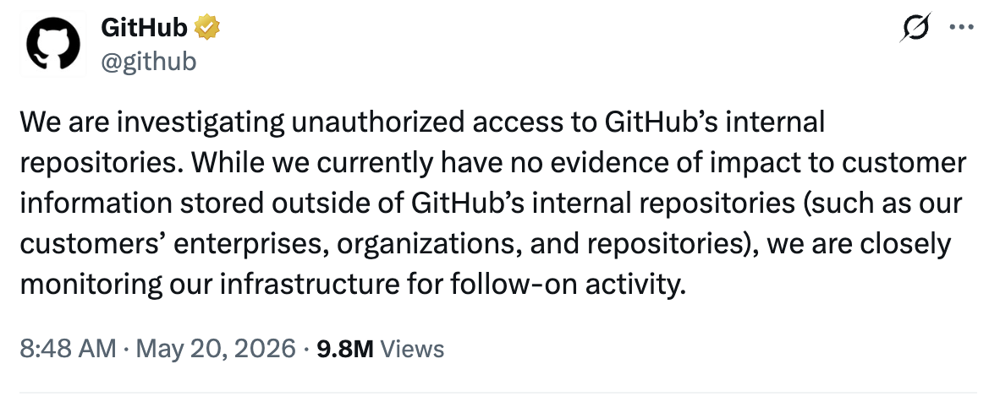

> **Dennis Kim · Cyber Threat Intelligence**

# 위협 인텔리전스 리포트 (CTI Report)

## GitHub 내부 저장소 무단 접근 사고 — 악성 VS Code 확장 기반 공급망 침해

<!-- 첨부 이미지: 동일 폴더에 동일 파일명으로 배치 시 자동 렌더링 -->


| 항목 | 값 | 항목 | 값 |
|---|---|---|---|
| **문서 번호** | CTI-2026-0520-GITHUB | **심각도** | **HIGH / 높음** |
| **작성일** | 2026-05-20 (KST) | **TLP** | **TLP:CLEAR** |
| **작성자** | Betalabs CTI (HoKwang Kim) | **검증 상태** | **CONFIRMED** |
| **대상** | GitHub (Microsoft), 전 세계 개발자/조직 | | |

---

## 0. 정보 검증 결과 (Source Verification)

의뢰된 X(트위터) 게시물 *(@github, status/2056884788179726685, 2026-05-19)*의 진위와 내용을 다중 출처 교차 검증한 결과, **'진짜(CONFIRMED)'**로 판단함.

| 검증 항목 | 결과 |
|---|---|
| **게시 계정 진위** | GitHub 공식 인증 계정 @github에서 게시. 후속 트윗 스레드(5/20, status 2056949168~)로 연속성 확인. |
| **내용 일치 여부** | CyberSecurityNews, SecurityWeek, KuCoin 등 복수 매체가 동일 트윗 원문 인용. 내용 일치. |
| **GitHub 공식 확인** | GitHub이 후속 스레드에서 침해 사실 및 '~3,800개 저장소' 주장이 조사와 'directionally consistent'라고 부분 시인. |
| **유의 사항** | 초기 발표가 X 단독으로만 이뤄져(블로그·상태페이지 미게시) 진위 혼선 및 비판 발생. 정황 신뢰도는 높으나 일부 수치는 '공격자 주장' 단계임. |

---

## 1. 요약 (Executive Summary)

2026년 5월 19일~20일, **GitHub(Microsoft)이 자사 내부 소스코드 저장소에 대한 무단 접근 사고**를 공식 확인함. 초기 침투 경로는 **악성(poisoned) VS Code 확장 프로그램**으로, 한 직원의 단말이 감염되며 내부 인프라로 침투가 이뤄짐.

재정적 동기를 가진 위협 그룹 **TeamPCP (Google GTIG 추적명 UNC6780)**가 범행을 주장. 약 4,000개의 비공개 저장소를 탈취했다고 다크웹 포럼에서 $50,000 이상에 판매 중. GitHub은 '~3,800개' 규모가 조사 결과와 방향적으로 일치한다고 일부 시인함.

현재까지 **고객(엔터프라이즈·조직·사용자) 저장소 및 데이터의 직접 유출 증거는 없음**. 단, 본 사고는 단순 1회성 침해가 아니라 **개발자 도구체인(IDE 확장·CI/CD·패키지) 표적화라는 2026년 공급망 공격 패턴의 연장선**이라는 점에서 전사적 대응이 요구됨.

---

## 2. 사고 개요 (Incident Overview)

| 항목 | 내용 |
|---|---|
| **최초 공개** | 2026-05-19, GitHub 공식 X 계정 (조사 착수 발표) |
| **상세 공개** | 2026-05-20, GitHub X 스레드 (1/~4) — 침투 경로·봉쇄 조치 공개 |
| **초기 침투 벡터** | 악성 VS Code 확장 → 직원 단말(엔드포인트) 감염 |
| **영향 범위(주장)** | 내부 저장소 ~3,800개 (GitHub 부분 시인) / ~4,000개 (TeamPCP 주장) |
| **고객 데이터** | 현재까지 직접 영향 증거 없음 (조사 진행 중) |
| **위협 행위자** | TeamPCP = UNC6780 (재정 동기, 공급망 공격 전문) |

---

## 3. 위협 행위자 프로파일 (Threat Actor)

**TeamPCP**는 Google Threat Intelligence Group이 **UNC6780**로 추적하는 고역량·재정 동기형 그룹으로, 교차 생태계(cross-ecosystem) 공급망 공격에 특화됨. 2026년 들어 다수의 보안·개발 도구를 연쇄 침해한 이력이 있음.

- **Trivy 취약점 스캐너:** CVE-2026-33634 악용, Cisco 포함 1,000여 조직 침해
- **Checkmarx · LiteLLM:** CI/CD 파이프라인 내 자격증명 수집 캠페인
- **Shai-Hulud 멀웨어:** 탈취 계정으로 자체 멀웨어 소스코드를 GitHub에 유출

**핵심 TTP:** 탈취한 CI/CD 자격증명과 권한 토큰을 활용해 대상 인프라 내부로 횡적 이동(pivot). 이번 GitHub 침해 주장의 기술적 신빙성을 높이는 근거.

---

## 4. 공격 흐름 및 MITRE ATT&CK 매핑

| 단계 | ATT&CK | 설명 |
|---|---|---|
| **초기 접근** | T1195.002 | 악성 VS Code 확장(공급망)으로 직원 단말 감염 |
| **실행** | T1059 | 확장 백그라운드에서 코드 실행 |
| **자격증명 탈취** | T1552.001 | 토큰·시크릿 무단 수집 |
| **횡적 이동** | T1021 | 내부 인프라/저장소 접근으로 확대 |
| **수집·유출** | T1567 | 내부 저장소 데이터 외부 반출 |

---

## 5. 영향 평가 (Impact Assessment)

- **직접 영향:** GitHub 내부 운영 코드·인프라 자동화 스크립트·민감 컴포넌트 유출 가능성
- **간접 위험:** 내부 코드 유출 시 향후 GitHub 플랫폼 대상 2차 취약점 발굴·악용 우려
- **고객 영향:** 현재 직접 증거 없음. 단, IDE 확장이 소스코드·자격증명·터미널에 접근 가능하다는 구조적 위험 노출
- **배경 정황:** 4월 말 Wiz의 CVE-2026-3854(RCE), 5월 Grafana 토큰 탈취 등 GitHub 생태계 연쇄 사고와 맞물림

---

## 6. 대응 권고 (Recommendations)

### 6.1 즉시 조치 (개발 조직/개인)

- **`.vscode/` 및 `.claude/` 디렉터리 점검 —** `router_runtime.js`, `setup.mjs` 등 미상 파일 존재 여부 확인
- **`gh-token-monitor` 데몬 탐색·제거 —** 토큰 폐기 시 `rm -rf`를 유발하는 데드맨 스위치로 보고됨. 토큰 회수 전 먼저 제거할 것
- 출처 불명·최근 설치된 VS Code 확장 전수 점검 및 제거
- GitHub PAT·OAuth 토큰·SSH 키 회전(rotate), 시크릿 스캐닝 활성화 확인

### 6.2 중기 조치 (조직 정책)

- IDE 확장을 **프로덕션 소프트웨어와 동급의 보안 자산**으로 취급 — 허용목록(allowlist)·버전 고정 운영
- 개발자 워크스테이션에 대한 최소권한·EDR·네트워크 분리 적용
- CI/CD 자격증명 단기수명화, 토큰 사용 감사로깅 의무화
- 공급업체 사고 통지 의무(**DORA, NIS2**) 대응 체계 점검

---

## 7. 탐지·모니터링 지표 (Detection)

> **주의:** 아래는 공개 보고 기반 점검 지표이며, 공식 IoC 세트는 GitHub의 후속 상세 리포트로 갱신 필요.

| 유형 | 점검 항목 |
|---|---|
| **파일** | `.vscode/`, `.claude/` 내 `router_runtime.js` · `setup.mjs` |
| **프로세스/데몬** | `gh-token-monitor` (데드맨 스위치) |
| **행위** | 확장에 의한 비정상 아웃바운드 통신, 토큰/시크릿 파일 접근 |
| **계정** | 개발자 토큰의 비정상 위치·시각 사용, 신규 권한 부여 |

---

## 8. 출처 (References)

- GitHub 공식 X (@github), status/2056884788179726685 (2026-05-19) 및 후속 스레드 (2026-05-20)
- CyberSecurityNews — "GitHub Hacked / GitHub Source Code Breach – TeamPCP" (2026-05-20)
- SecurityWeek — "Critical GitHub Vulnerability (CVE-2026-3854)" (2026-04)
- Google Threat Intelligence Group (GTIG) — UNC6780 추적 정보

---

*본 문서는 공개 출처 정보(OSINT) 기반으로 작성되었으며, 일부 수치는 위협 행위자 주장 또는 GitHub의 잠정 평가 단계임. 공식 상세 리포트 공개 시 갱신 권장.*

---
---

<!-- ============================================================
     LLM / 검색 최적화 부록 (LLM-Optimized Index)
     아래 섹션은 검색·임베딩·RAG 검색 용이성을 위한 구조화 데이터입니다.
     ============================================================ -->

## 부록 A. LLM 검색 최적화 인덱스 (Machine-Readable Summary)

### A-1. 한 줄 요약 (TL;DR)
2026년 5월, GitHub이 악성 VS Code 확장으로 인한 직원 단말 침해를 통해 내부 저장소 약 3,800~4,000개에 무단 접근당한 사고. 위협 행위자는 TeamPCP(UNC6780). 고객 데이터 직접 유출 증거는 현재 없음.

### A-2. 핵심 사실 (Key Facts)
- **사고 유형:** 공급망 침해 (Supply Chain Compromise) via 악성 IDE 확장
- **피해 조직:** GitHub (Microsoft 소유)
- **공개 일자:** 2026-05-19 (조사 착수), 2026-05-20 (상세 공개)
- **침투 벡터:** Poisoned VS Code Extension → 직원 엔드포인트 감염
- **위협 행위자:** TeamPCP (= Google GTIG 추적명 UNC6780, 재정 동기형)
- **영향 규모:** 내부 저장소 ~3,800개(GitHub 부분 시인) / ~4,000개(공격자 주장)
- **판매 정황:** 다크웹 포럼, $50,000 이상 요구
- **고객 영향:** 직접 증거 없음 (조사 진행 중)
- **검증 상태:** CONFIRMED (다중 출처 교차 검증)

### A-3. 엔티티 (Named Entities)
- **조직:** GitHub, Microsoft, Cisco, Grafana, Wiz, Google GTIG
- **위협 행위자/별칭:** TeamPCP, UNC6780
- **악성/도구:** Shai-Hulud (멀웨어), Trivy, Checkmarx, LiteLLM
- **CVE:** CVE-2026-3854 (GitHub RCE), CVE-2026-33634 (Trivy)
- **규제 프레임워크:** DORA, NIS2
- **IoC 키워드:** router_runtime.js, setup.mjs, gh-token-monitor, .vscode/, .claude/

### A-4. 자주 묻는 질문 (FAQ for Retrieval)
**Q. 이 X 게시물은 진짜인가?**
A. 진짜다(CONFIRMED). GitHub 공식 계정 @github의 게시물이며, 후속 스레드 및 복수 보안 매체로 교차 검증됨.

**Q. 어떻게 침투했나?**
A. 악성(poisoned) VS Code 확장이 한 직원의 단말을 감염시켜 내부 인프라로 횡적 이동했다.

**Q. 누가 했나?**
A. 재정 동기형 위협 그룹 TeamPCP(Google GTIG 추적명 UNC6780).

**Q. 몇 개 저장소가 영향을 받았나?**
A. GitHub은 약 3,800개가 조사와 방향적으로 일치한다고 시인했고, 공격자는 약 4,000개를 주장했다.

**Q. 고객(사용자) 데이터가 유출됐나?**
A. 현재까지 고객 엔터프라이즈·조직·사용자 저장소의 직접 유출 증거는 없다.

**Q. 무엇을 점검해야 하나?**
A. `.vscode/`·`.claude/` 내 `router_runtime.js`/`setup.mjs`, `gh-token-monitor` 데몬을 점검·제거하고, 토큰·SSH 키를 회전하라.

**Q. 왜 진위 논란이 있었나?**
A. GitHub이 초기 발표를 로그인 필요 플랫폼인 X에서만 단독 게시하고 블로그·상태페이지에는 올리지 않아 비판받았다.

### A-5. 검색 태그 (Search Tags)
`#GitHub침해` `#GitHubBreach` `#VSCode확장악성` `#PoisonedExtension` `#공급망공격` `#SupplyChainAttack` `#TeamPCP` `#UNC6780` `#소스코드유출` `#SourceCodeLeak` `#IDE보안` `#CICD보안` `#데드맨스위치` `#DeadManSwitch` `#CTI` `#위협인텔리전스` `#OSINT` `#TLPCLEAR` `#CVE_2026_3854` `#CVE_2026_33634` `#Microsoft` `#개발자보안`

### A-6. 구조화 메타데이터 (JSON-LD style)
```json
{
  "@type": "CyberThreatReport",
  "docId": "CTI-2026-0520-GITHUB",
  "title": "GitHub 내부 저장소 무단 접근 사고 — 악성 VS Code 확장 기반 공급망 침해",
  "severity": "HIGH",
  "tlp": "TLP:CLEAR",
  "verificationStatus": "CONFIRMED",
  "publishedDate": "2026-05-20",
  "author": "Dennis Kim (HoKwang Kim)",
  "organization": "Betalabs CTI",
  "language": "ko",
  "victim": { "name": "GitHub", "owner": "Microsoft" },
  "threatActor": { "name": "TeamPCP", "aliases": ["UNC6780"], "motivation": "financial" },
  "attackVector": "Malicious VS Code Extension (Supply Chain)",
  "impactScope": { "internalReposClaimed": 4000, "internalReposPartiallyConfirmed": 3800, "customerDataImpact": "none confirmed" },
  "mitreAttack": ["T1195.002", "T1059", "T1552.001", "T1021", "T1567"],
  "relatedCve": ["CVE-2026-3854", "CVE-2026-33634"],
  "iocKeywords": ["router_runtime.js", "setup.mjs", "gh-token-monitor", ".vscode/", ".claude/"],
  "regulatoryRefs": ["DORA", "NIS2"],
  "sourceTweet": "https://x.com/github/status/2056884788179726685"
}
```

<!-- END OF DOCUMENT — CTI-2026-0520-GITHUB (ko) -->
