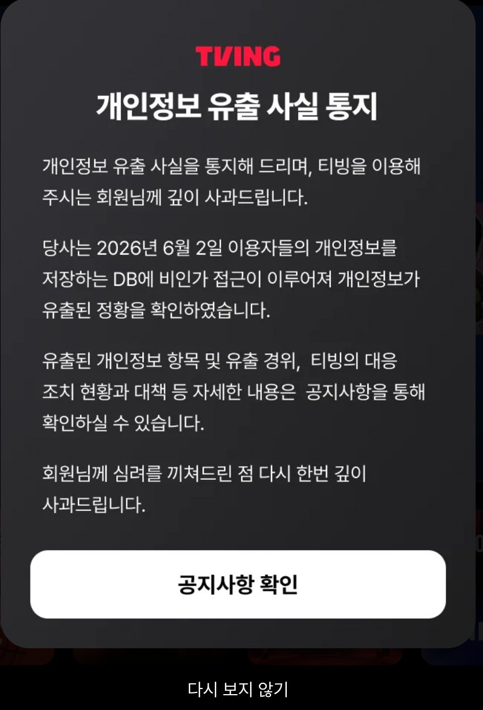
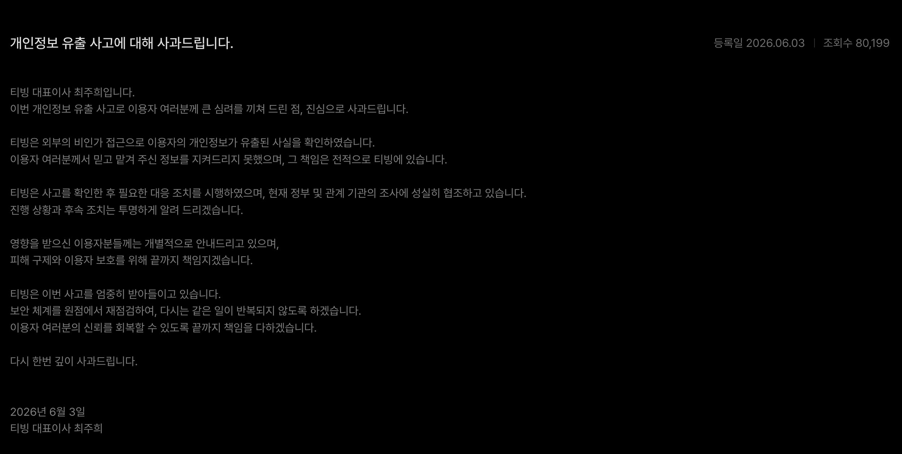
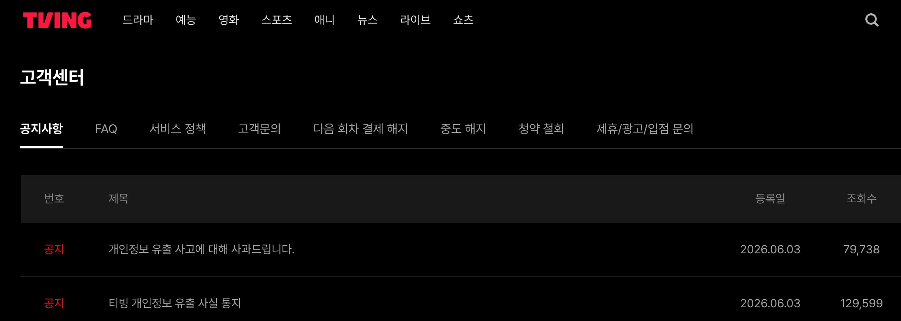
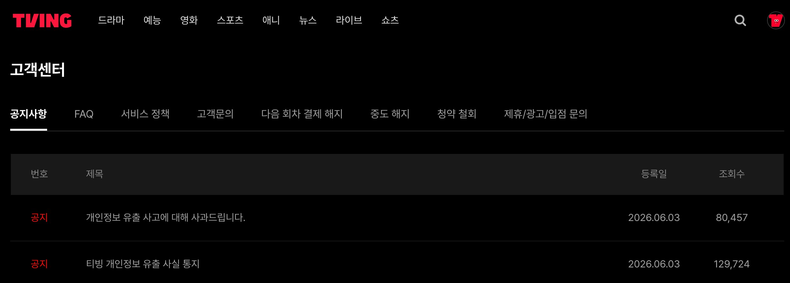

| id             | CTI-2026-0604-TVING                                                                                       |
| -------------- | --------------------------------------------------------------------------------------------------------- |
| title          | 500만의 유출, 13만의 인지 — 티빙 개인정보 침해와 통지 다크패턴                                                     |
| subtitle       | 다크패턴 UX는 본질을 가린다. 외부에 열려 있던 DB 망, 통제되지 않은 이그레스, 그리고 스팸 광고처럼 설계된 통지 팝업      |
| author         | Dennis Kim / HoKwang Kim                                                                                    |
| email          | <gameworker@gmail.com>                                                                                      |
| github         | gameworkerkim                                                                                               |
| date           | 2026-06-04                                                                                                  |
| updated        | 2026-06-06 (v1.1 — 유출 경위 추보: News1 단독 보도 기반 KISA 신고서 분석 반영)                                  |
| classification | TLP:GREEN                                                                                                   |
| severity       | HIGH                                                                                                        |
| lang           | ko                                                                                                          |
| tags           | Data-Breach · OTT · Dark-Pattern · Notification-Suppression · Egress-Control · CI-DI · Cloud-Security · K-Privacy |
| threat\_actors | Unattributed (신원 미상, 개인정보위·KISA 조사 진행 중)                                                          |
| frameworks     | MITRE ATT&CK · NIST SP 800-61 · NIST SP 800-207 (Zero Trust) · 개인정보보호법 제34조                          |
| license        | CC BY-NC-SA 4.0                                                                                             |

# 500만의 유출, 13만의 인지 — 티빙 개인정보 침해와 통지 다크패턴

> **리포트 ID** `CTI-2026-0604-TVING` · **발행일** 2026-06-04 · **분류** `TLP:GREEN` · **심각도** 🔴 HIGH
> **저자** Dennis Kim / HoKwang Kim · <gameworker@gmail.com> · [@gameworkerkim](https://github.com/gameworkerkim)

🌐 **한국어 (이 문서)** · [English](CTI-2026-0604-TVING_EN.md) · [日本語](CTI-2026-0604-TVING_JA.md) · [中文](CTI-2026-0604-TVING_ZH.md)

*다크패턴 UX는 본질을 가린다. 외부에 열려 있던 DB 망, 통제되지 않은 이그레스, 그리고 스팸 광고처럼 설계된 통지 팝업*

---

## 목차

1. 요약 (TL;DR)
2. 시작하는 말 — "다크패턴 UX는 본질을 가린다"
3. 사건 타임라인
4. 침해 분석 — 세 겹의 통제가 동시에 뚫렸다 (3.5 유출 경위 추보 포함, v1.1)
5. 통지 다크패턴 분석 — 광고의 문법으로 쓰인 법정 통지
6. 정량 분석 — 6월 4일 오후 10시, 인지자는 여전히 소수다
7. 유출 항목의 위험 평가 — CI는 비밀번호가 아니다
8. 한국 관점 — 규제 공백과 이중 유출 집단
9. 탐지·완화·대응 권고
10. 결론
11. 참고 문헌

---

## 요약 (TL;DR)

2026년 6월 초, CJ ENM 산하 국내 최대 OTT 티빙(TVING)에서 이용자 개인정보 DB에 대한 비인가 접근과 대량 외부 전송이 발생했다. 유출 항목은 아이디, 이름, 생년월일, 성별, **CI(연계정보), DI(중복가입확인정보)**, 휴대전화번호, 이메일, 환불 계좌번호, 비밀번호(단방향 암호화) 등이다. 유료 가입자 약 500만, MAU 550만~700만대 중반의 서비스에서 변경 불가능한 영구 식별자(CI)까지 빠져나간 중대 침해다.

본 리포트는 이 사건을 두 개의 실패가 포개진 구조로 읽는다.

- **유출 이전 — 망 구조의 실패.** 회사가 밝힌 사후 조치(공격자 IP 차단, 클라우드 접근 통제 정책 변경, DB 접속 모니터링 강화)를 역으로 읽으면, 개인정보 DB에 외부에서 도달 가능한 경로가 존재했고(인그레스 실패), 대량 파일이 외부로 전송되는 동안 아웃바운드가 통제되지 않았으며(이그레스 실패), 대량 반출의 뚜렷한 시그니처가 실시간 탐지되지 않았다(탐지 실패). 심층 방어 세 계층의 연쇄 부재로 볼 수 있다.
- **유출 이후 — 사고 통지 설계의 실패.** 인앱 유출 통지 팝업은 광고·이벤트 모달과 동일한 시각 문법으로 제작됐고, 닫기 버튼 없이 **"다시 보지 않기"**만 제공했다. 결과는 숫자로 확인된다. 공지 등록 후 약 36시간이 지난 6월 4일 오후 10시경에도 유출 통지 누적 조회수는 129,724건, 유료 가입자 대비 약 2.6%에 머물렀다. 개인정보 유출을 인지한 사람이 소수에 불과하도록 다크패턴이 작동한 것이다.

본 리포트의 명제는 하나다. **다크패턴 UX는 본질을 가린다는 것.** 유출의 본질(영구 식별자의 반출, 망 구조의 결함, 사용자가 지금 취해야 할 행동)이 대수롭지 않은 일상의 광고의 UX 뒤로 숨었고, 법정 통지는 형식적으로 이행됐으되 실질적으로 피해를 입은 500만명의 고객에게 도달하지 않았다.

> ⚠️ **조사 진행 중 사안** — 침해 경위와 규모는 개인정보보호위원회·KISA 조사로 확정될 예정이다. 본 리포트의 기술 분석은 회사 공지와 공개 보도 기반의 추론이며, 각 판단에 신뢰도를 명시한다.

> 🔄 **[v1.1 추보, 2026-06-06]** — News1 단독 보도(6/5)로 KISA 침해사고 신고서의 내용이 일부 공개됐다. 신고서는 "비인가 접근 및 쿼리 실행"을 명시했고, 사고 발생 시각은 5월 30일 18:01, 인지 시각은 5월 31일 15:09(DB CPU 점유율 100% 포화 계기), KISA 신고는 6월 1일 15:08 — **24시간 법정 기한 1분 전**이었다. 역추적 결과 직원이 GitHub에 AWS 액세스 키를 하드코딩한 사실이 확인됐고, 회사는 노출 키를 비활성화·교체했다. 상세 분석은 3.5절. 본 리포트 v1.0의 가설(클라우드 자격증명 경유 인그레스 실패, DB CPU 스파이크 미탐지)과 정합하는 내용이다.

[오픈 소스 - LLM 기반 github - LAON VaultGuard LLM-based Automated Observer for Non-public Keys]

티빙 해킹 사건으로 Github를 비롯한 저장소에 각종 클라우드 접근 토큰 유출을 방지하기 위한 LLM 모니터링 도구 소스를 무료 공개합니다.
이런건 LLM이 정기적으로 모니터링만해도 큰 사고를 막을 수 있습니다.

👉 [LAON VaultGuard - LLM-based Automated Observer for Non-public Keys](https://github.com/gameworkerkim/vibe-investing/blob/main/LAON_VaultGuard/README.md)

[오픈 소스 - LLM 보안 하네스 프롬프트 공개]

node.js 기반 데몬을 돌리기 부담스러우시다면, LLM 프롬프트를 공개합니다.티빙 해킹 사건으로 GitHub를 비롯한 저장소에 각종 클라우드 접근 토큰 유출을 방지하기 위한 LLM 하네스 프롬프트를 무료로 공개합니다.

👉 [Secret Scanning LLM Harness Prompt](https://github.com/gameworkerkim/vibe-investing/blob/main/TechDoc/LLM_Security/Secret%20scanning%20llm%20harness%20prompt.md)

### Key Judgments

| #    | 판단                                                                                                                                                                          | 신뢰도             |
| ---- | ----------------------------------------------------------------------------------------------------------------------------------------------------------------------------- | --------------- |
| KJ-1 | 인앱 유출 통지 팝업은 광고 모달의 시각 문법과 "다시 보지 않기" 단일 닫기 옵션을 결합한 **통지 억제 패턴(notification suppression pattern)**으로 기능했다. 의도 여부와 무관하게 결과는 피해자 인지율의 구조적 억제다. | **High**        |
| KJ-2 | 공지 등록 약 36시간 후인 6월 4일 22:00경 기준 통지 조회수 129,724건은 가입자 대비 약 2.6%, MAU 대비 약 1.9%다. 언론·중복·비회원 조회를 감안하면 실제 피해 당사자 인지율은 이보다 낮다.                          | **High**        |
| KJ-3 | 측정 구간(21:43→21:55) 조회수 증가는 분당 약 10건 수준이다. 이 속도가 유지돼도 전 가입자 도달에 산술적으로 320일 이상이 걸리며, "다시 보지 않기"로 재노출이 영구 차단된 사용자가 누적되므로 실제 도달률은 한 자릿수 %에서 포화될 가능성이 높다. | **Medium-High** |
| KJ-4 | "공격자 IP 차단"과 "클라우드 접근 통제 정책 변경"이라는 사후 조치는 개인정보 DB 계층에 **외부 도달 가능 경로가 사전에 존재했음**을 시사한다.                                                                   | **Medium-High** |
| KJ-5 | 개인정보 파일의 외부 전송이 완료됐다는 사실은 DB 세그먼트의 **이그레스(아웃바운드) 통제와 대량 반출 이상행위 탐지가 부재했거나 작동하지 않았음**을 시사한다.                                                        | **Medium-High** |
| KJ-6 | 유출된 CI·DI는 변경 불가능한 영구 식별자로, 타 서비스 계정 크로스 매칭·본인확인 우회·정밀 스피어피싱의 재료가 된다. 휴대전화·이메일 동반 유출과 결합 시 **2차 피해(피싱·스미싱) 캠페인 가능성이 높다**.                   | **High**        |
| KJ-7 | 현행 개인정보보호법은 통지의 "내용"을 규정하나 통지의 "UX"(닫기 버튼, 재노출 정책, 광고 모달과의 구분)는 규율하지 않는다. 본 건은 **통지 다크패턴이라는 규제 공백**의 선례 사안이 될 가능성이 높다.                        | **Medium-High** |
| KJ-8 | *(v1.1 신규)* GitHub에 하드코딩된 AWS 액세스 키가 사고 직후 비활성화·교체됐다는 신고서 내용은, 침입 경로가 **공개 코드 저장소에서 수집된 클라우드 자격증명**일 가능성을 강하게 시사한다. 단, News1 보도 자체가 명시하듯 신고서만으로 침입 경로가 확정된 것은 아니다. | **Medium-High** |
| KJ-9 | *(v1.1 신규)* 공격 개시(5/30 18:01)부터 인지(5/31 15:09)까지 약 21시간 동안 공격자는 DB에서 활동했고, 인지의 계기는 보안 알람이 아니라 **DB CPU 점유율 100% 포화**였다. 쿼리 기반 이상행위 탐지가 작동하지 않았다는 v1.0의 탐지 실패 가설을 뒷받침한다. | **High**        |

---

## 1. 시작하는 말 — "다크패턴 UX는 본질을 가린다"

침해사고 대응의 마지막 단계는 기술이 아니라 인간 감정을 다루는 커뮤니케이션이다. 그리고 커뮤니케이션의 설계는 그 자체로 사고를 당한 회사의 신뢰와 불신의 시그널을 보여준다. 법으로 정한 침해 사고 통지가 도달하지 않으면 피해자는 비밀번호를 바꾸지 않고, 피싱 문자를 의심하지 않으며, 자신의 CI가 어딘가에서 거래되고 있을 가능성을 모른 채 살아간다. 통지의 실패는 곧 2차 피해 방어선의 실패로 이어질 수 있다.

티빙의 인앱 통지 팝업을 보자. 어두운 오버레이, 흰색 주 버튼("공지사항 확인"), 하단의 흐릿한 "다시 보지 않기". 단순 "닫기"는 없다. 이 레이아웃은 한국 앱 생태계에서 수년간 이벤트·광고 모달에 사용돼 온 문법과 정확히 일치하며, 사용자는 이 패턴을 0.5초 안에 반사적으로 닫도록 학습돼 있다. 선택지는 "지금 읽기" 아니면 "영구 미노출" 둘뿐이다. 형식적 통지 이행의 알리바이는 확보하면서 실제 인지율은 최소화하는 구조다.

*그림 1. 티빙 인앱 유출 통지 팝업 (2026-06-04 캡처). 흰색 주 버튼 "공지사항 확인"과 하단 저대비 "다시 보지 않기"의 양자택일 구조. 단순 "닫기"는 존재하지 않는다.*

**다크패턴 UX는 본질을 가린다.** 이 사건에서 가려진 본질은 세 가지다. 첫째, 변경 불가능한 영구 식별자(CI·DI)가 유출됐다는 사실. 둘째, 그 유출을 가능케 한 망 구조의 결함. 셋째, 사용자가 지금 당장 취해야 할 행동(비밀번호 변경, 피싱 경계). 광고의 문법으로 포장된 통지는 이 세 가지를 모두 "다시 보지 않기" 한 번의 탭 뒤로 치웠다. 그 결과, 공지 등록 후 36시간이 지난 6월 4일 오후 10시 기준에도 개인정보 유출을 인지한 사람은 가입자 100명 중 두세 명 수준의 소수에 불과했다.

**도달하지 않도록 설계된 통지는 신의와 성실을 벗어나 고지가 아니다.**

---

## 2. 사건 타임라인

| 일시 | 사건 | 비고 |
| --- | --- | --- |
| 2026-05-30 18:01 | 인가되지 않은 AWS 환경 내 DB 접근 발생, 무단 SQL 쿼리 실행 | KISA 신고서 기준 사고 발생 시각 (News1 보도, v1.1) |
| 2026-05-31 15:09 | DB CPU 점유율 100% 포화를 계기로 비인가 접근 인지 | 공격 개시 후 약 21시간 경과 (v1.1) |
| 2026-06-01 15:08 | 티빙, KISA에 침해사고 신고 | 정보통신망법상 24시간 신고 기한 **1분 전** (v1.1) |
| 2026-06-02 | 회사 공지 기준 "유출 정황 확인" | 외부 전송(유출) 범위 확정 시점으로 추정 |
| 2026-06-03 02:00경 | 개인정보보호위원회, 유출 신고 접수 및 조사 착수 | |
| 2026-06-03 | 홈페이지·앱 공지 게재, 인앱 팝업 노출 시작, 최주희 대표 사과문 게재 | 이메일·문자 개별 통지 병행 표명 |
| 2026-06-04 21:43 | 유출 통지 조회수 129,599 / 사과문 79,738 | 1차 측정 (고객센터 목록) |
| 2026-06-04 21:55 | 유출 통지 조회수 129,724 / 사과문 80,457 | 2차 측정 — 12분 간 통지 +125건 |
| 2026-06-05 | News1, KISA 신고서 내용 단독 보도 — "비인가 접근 및 쿼리 실행", AWS 키 폐기·GitHub 자격증명 교체 | 본 리포트 v1.1 추보의 근거 |

**타임라인에서 짚을 점**

v1.0에서 지적한 과기부 신고(6/1)와 공지문상 "확인"(6/2)의 불일치는 신고서 공개로 해소됐다 — 인지는 5/31 15:09, 신고는 6/1 15:08, "확인"은 유출 범위 확정 시점이다. 새로 드러난 쟁점은 두 가지다. 첫째, KISA 신고가 24시간 법정 기한의 **1분 전**에 이뤄졌다는 점. 위법은 아니나, 기한의 마지막 1분까지 소진한 신고는 준법의 형식적 충족이라는 신호로 읽히며, 통지 팝업의 형식적 이행과 같은 결을 이룬다. 둘째, 인지(5/31 15:09)로부터 이용자 통지(6/3)까지 약 2일이 걸렸다는 점 — 개인정보보호법상 72시간 통지 기한 내이긴 하나, 그 사이 피해자들은 무방비 상태였다.

---

## 3. 침해 분석 — 세 겹의 통제가 동시에 뚫렸다

회사가 공개한 사실관계는 간결하다. 신원 미상의 공격자가 개인정보 저장 DB에 접속해 개인정보 파일을 외부로 전송했고, 회사는 인지 후 (1) 공격자 IP 접근 차단, (2) 클라우드 접근 통제 정책 변경, (3) DB 접속 모니터링 강화를 시행했다. 사후 조치 목록은 곧 사전 부재 목록이다.

### 3.1 인그레스 실패 — DB는 왜 바깥과 대화할 수 있었나?

"공격자 IP를 차단했다"는 것은 차단 전까지 외부 IP가 DB 계층과 통신 가능했다는 뜻이다. "클라우드 접근 통제 정책을 변경했다"는 것은 기존 정책이 그 통신을 허용하고 있었다는 뜻이다. 정상 아키텍처라면 개인정보 DB는 프라이빗 서브넷에 격리되고, 접근은 배스천 호스트 또는 제로트러스트 게이트웨이(NIST SP 800-207)를 경유한 내부 애플리케이션 계층으로 한정된다.

침해 경로가 애플리케이션 취약점 경유든, 탈취된 클라우드 자격증명이든, 잘못 설정된 보안 그룹이든 결과적으로 **보안 경계 통제**가 실패했다.

### 3.2 이그레스 실패 — 반출은 왜 막히지 않았나?

이번 사고는 단순 조회가 아니라 **"파일의 외부 전송"**으로 완성됐다. 수백만 건 규모로 추정되는 개인정보 파일이 DB 망을 빠져나가는 동안 아웃바운드 통제가 작동하지 않았다.

개인정보 DB 세그먼트는 인바운드만큼 아웃바운드도 화이트리스트로 잠가야 한다. 허용된 내부 목적지 외의 외부 전송은 기본 차단(default deny)이어야 하고, 대량 반출은 DLP·네트워크 플로우 모니터링이 절단해야 한다. 둘 다 없었거나, 있었으나 작동하지 않았다.

### 3.3 탐지 실패 — 대량 덤프의 시그니처는 왜 울리지 않았나?

대량 덤프는 시그니처가 뚜렷하다. 평시 대비 비정상 쿼리 볼륨, 전체 테이블 스캔, 비정상 시간대 접속, DB CPU 스파이크, 단일 세션의 대량 전송. **"DB 접속 모니터링 강화"**가 사후 조치로 등장했다는 것은 이런 신호가 실시간 알람으로 이어지는 체계가 사전에 충분치 않았음을 시사한다. 인지 시점이 반출 도중이 아니라 반출 이후였다면, 기존 탐지 체계는 사실상 사후 포렌식용이었다는 뜻이 된다.

### 3.4 MITRE ATT&CK 매핑 (v1.1 갱신)

| 단계 | 기법 | 비고 |
| --- | --- | --- |
| Reconnaissance | **T1593.003** Search Open Websites/Domains: Code Repositories | GitHub에 하드코딩된 AWS 키의 수집 경로로 추정 (v1.1) |
| Initial Access | **T1078.004** Valid Accounts: Cloud Accounts | v1.0의 양대 가설 중 우세 가설로 상향 — 노출 키 비활성화·교체와 정합 (v1.1) |
| Credential Access | **T1552.001** Unsecured Credentials: Credentials In Files | 직원이 공개 저장소에 AWS 액세스 키를 하드코딩 (v1.1) |
| Collection | **T1005** Data from Local System / **T1213** Data from Information Repositories | 개인정보 DB 대상 무단 SQL 쿼리 실행 — 신고서 명시 (v1.1) |
| Exfiltration | **T1048** Exfiltration Over Alternative Protocol / **T1567** Exfiltration Over Web Service | 외부 전송 채널 미공개 |

신고서 공개로 v1.0의 가설 트리 중 T1078.004(클라우드 자격증명) 경로의 신뢰도가 상승했으나, News1 보도 자체가 명시하듯 침입 경로가 공식 확정된 것은 아니다. 조사 결과 공개 시 갱신한다. 요컨대 이번 침해는 단일 취약점의 문제가 아니라 심층 방어(defense in depth)의 연쇄 부재다. 경계–이그레스–탐지 세 계층 중 어느 하나만 정상이었어도 유출은 차단되거나 조기에 절단됐을 것이다.

### 3.5 유출 경위 추보 (v1.1) — GitHub에 하드코딩된 AWS 액세스 키

News1이 6월 5일 단독 보도한 KISA 침해사고 신고서 내용은 v1.0의 추론을 상당 부분 구체화한다. 신고서는 "비인가 접근 및 쿼리 실행"을 명시했다. 공격자는 파일을 받아간 것이 아니라 **DB 서버에 직접 접근해 SQL 쿼리를 실행**했다 — 단순 유출이 아니라 DB 침입이다. 그리고 사고 직후 티빙이 취한 조치는 AWS 액세스 키 폐기와 GitHub 자격증명 교체였으며, 역추적 결과 **직원이 GitHub에 AWS 액세스 키를 하드코딩**한 사실이 확인됐다.

이 사실관계는 세 가지 실패의 결합을 시사한다.

**첫째, 시크릿 관리의 실패.** AWS 액세스 키가 코드 저장소에 하드코딩됐다는 것은 시크릿 스캐닝(GitHub secret scanning, pre-commit 훅, truffleHog 류), 코드 리뷰, 시크릿 매니저 사용 강제 중 어느 것도 이 키를 걸러내지 못했다는 뜻이다. 공개 저장소에 노출된 AWS 키는 통상 수 분 내에 자동화 크롤러에 수집된다 — 공격자 입장에서 가장 저렴한 침입 경로다.

**둘째, 권한 설계의 실패.** 하드코딩된 키 하나로 개인정보 DB까지 도달해 쿼리를 실행할 수 있었다면, 그 키는 최소 권한 원칙과 거리가 멀었다. 장기 자격증명(long-lived access key) 대신 STS 기반 단기 자격증명을 썼거나, 키의 IAM 정책이 DB 접근을 차단했거나, DB가 IAM 인증·네트워크 격리로 한 겹 더 보호됐다면 키 노출이 곧 DB 침입으로 직결되지는 않았을 것이다. v1.0의 3.1(인그레스 실패)이 가설로 제시한 "탈취된 클라우드 자격증명" 경로가 바로 이것이다.

**셋째, 탐지의 실패 — 그리고 그 확인.** 공격은 5월 30일 18:01에 시작됐고, 인지는 다음 날 15:09 — 공격자는 약 21시간 동안 DB에서 활동했다. 더 주목할 것은 인지의 계기다. 쿼리 이상행위 알람이 아니라 **DB CPU 점유율 100% 포화**였다. v1.0의 3.3절이 대량 덤프의 시그니처로 나열한 항목(비정상 쿼리 볼륨, 전체 테이블 스캔, DB CPU 스파이크) 중 가장 마지막의, 가장 둔탁한 신호가 울리고 나서야 침입이 인지된 것이다. 공격자가 쿼리 강도를 조절해 CPU 포화를 피했다면 체류 시간은 21시간보다 훨씬 길어졌을 것이다.

신고 타이밍도 기록해 둘 가치가 있다. 정보통신망법 시행령은 침해사고 인지 후 24시간 이내 신고를 요구하는데, 티빙의 KISA 신고는 인지(5/31 15:09)로부터 23시간 59분이 지난 6월 1일 15:08 — **기한 1분 전**이었다. 위법은 아니다. 그러나 기한의 마지막 1분까지 소진한 신고는, 닫기 없는 통지 팝업과 같은 결의 신호다. 준법의 최소선을 형식적으로 충족하는 조직 문화가 유출 전(시크릿 관리)과 유출 후(통지 설계) 양쪽에서 일관되게 관측된다.

> 단서: News1 보도가 명시하듯, 공개된 신고서만으로 실제 침입 경로가 AWS 키 또는 자격증명 유출이었는지는 확정되지 않는다. 키 폐기·교체는 예방적 조치였을 가능성도 배제할 수 없다. 본 절의 분석은 신고서 기재 사실과 조치의 정합성에 기반한 우세 가설이며, 민관합동조사단의 결과로 확정될 사안이다.

---

## 4. 통지 다크패턴 분석 — 광고의 문법으로 쓰인 법정 통지

### 4.1 팝업 구조 해부

| 요소 | 구현 | 효과 |
| --- | --- | --- |
| 시각 문법 | 어두운 오버레이 + 중앙 모달 | 광고·이벤트 팝업과 동일한 인지 프레임 — 반사적 닫기 유도 |
| 주 버튼 | "공지사항 확인" (흰색, 강조) | 핵심 정보를 한 단계 더 깊은 깔때기로 이전 |
| 닫기 옵션 | "다시 보지 않기" 단독 (하단, 저대비) | "지금 읽기" 또는 "영구 미노출"의 양자택일 강제 |
| 본문 정보량 | 유출 항목·경위·대응·접수처 전부 부재 | 법정 통지 필수 요소를 팝업 밖으로 외주화 |

개인정보보호법 제34조와 시행령은 통지에 유출 항목, 시점과 경위, 피해 최소화 방법, 대응 조치, 피해 구제 절차, 접수 부서·연락처를 담도록 요구한다. 이 팝업은 그 전부를 "공지사항을 통해 확인하실 수 있습니다"로 밀어냈다. 클릭 깔때기가 하나 늘 때마다 도달률은 한 자릿수 비율로 깎인다.

### 4.2 왜 이것이 다크패턴인가?

다크패턴의 정의적 특징은 사용자의 학습된 행동을 사업자의 이익 방향으로 역이용하는 인터페이스 설계다. 한국 앱 사용자는 수년간 동일 레이아웃의 광고 모달을 즉시 닫도록 훈련됐다. 법정 의무 통지를 그 문법에 담는 순간, 설계자는 사용자가 읽지 않고 닫을 것을 통계적으로 알 수 있는 위치에 선다. 여기에 "닫기" 대신 "다시 보지 않기"를 유일한 이탈 경로로 배치하면, 한 번의 반사적 탭이 영구적 정보 차단으로 전환된다.

이메일, 문자 개별 통지가 병행됐다는 회사 측 설명은 면책 사유가 되기 어렵다. 전화번호와 이메일이 유출된 사고에서, 이메일 통지는 그 자체로 피싱 메일과 구분되지 않아 무시·삭제될 확률이 높다. 사용자가 본인 의사로 직접 접속한 가장 신뢰도 높은 채널 — 인앱 — 을 가장 닫기 쉽게 설계했다는 사실이 핵심이다.

### 4.3 대표 사과문 분석 — 책임 인정은 있으나 행동 지침이 없다

최주희 대표 명의의 6월 3일 사과문은 책임 소재를 명확히 인정한다("그 책임은 전적으로 티빙에 있습니다"). 외부 비인가 접근으로 인한 유출 확인, 정부·관계 기관 조사 협조, 영향 이용자 개별 안내, 보안 체계의 원점 재점검 약속이 담겼다. 위기 커뮤니케이션의 책임 인정 요건은 충족한 문서다.

*그림 2. 최주희 대표 명의 사과문 (2026-06-03). 책임 인정의 수사는 충분하나, 유출 항목·비밀번호 변경 권고·접수처 등 피해자의 방어 행동으로 이어지는 정보는 전무하다.*

그러나 사과문 역시 피해자 관점의 핵심에서 살펴보자. 무엇이 유출됐고, 지금 무엇을 해야 하는가를 담지 않았다. 유출 항목 목록, 비밀번호 변경 권고, 피싱 경계 안내, 피해 접수 연락처가 모두 부재하다. 사과의 수사는 충분하되 방어 행동으로의 전환 장치(call to action)가 없는 문서이며, 이는 인앱 팝업의 정보 외주화 패턴과 일관된다. 사과문 조회수(6/4 21:55 기준 80,457)가 통지 조회수보다도 낮다는 점까지 더하면, 책임 인정의 메시지조차 가입자의 1.6%에게만 도달했다.

---

## 5. 정량 분석 — 6월 4일 오후 10시, 인지자는 여전히 소수다

### 5.1 측정값

| 지표 | 6/4 21:43 (1차) | 6/4 21:55 (2차) | 증가 |
| --- | --- | --- | --- |
| 유출 사실 통지 조회수 | 129,599 | 129,724 | +125 |
| 대표 사과문 조회수 | 79,738 | 80,457 | +719 |

*그림 3. 1차 측정 (2026-06-04 21:43). 유출 사실 통지 129,599 / 대표 사과문 79,738.*

*그림 4. 2차 측정 (2026-06-04 21:55). 12분 간 유출 통지 +125건, 분당 약 10건의 증가율.*

### 5.2 도달률 환산 (2차 측정 기준)

| 기준 모수 | 도달률 | 비고 |
| --- | --- | --- |
| 유료 가입자 약 500만 | **약 2.6%** | 129,724 / 5,000,000 |
| MAU 700만 (상단 추정) | **약 1.9%** | 129,724 / 7,000,000 |

### 5.3 해석 — 뉴스에 나오지 않고 VoC가 없었으면 좋겠어요

공지 등록(6월 3일)으로부터 약 36시간이 경과한 6월 4일 오후 10시 시점에도, 유출 사실을 통지 공지로 인지한 사람은 누적 13만 명, 가입자 100명 중 두세 명 수준의 소수에 불과하다. 측정 구간의 증가율(12분 간 +125건, 분당 약 10건)을 그대로 연장해도 일 약 1만 5천 건, 전 가입자 도달까지 산술적으로 320일 이상이 걸린다. 그러나 실제 곡선은 이보다 나쁘다. "다시 보지 않기"를 누른 사용자는 재노출 모수에서 영구히 제외되므로, 시간이 갈수록 신규 도달 가능 인구 자체가 줄어든다. 통지 도달률은 한 자릿수 퍼센트에서 포화하는 구조이며, 이것이 통지 억제 패턴의 시계열적 증거로 볼 수 있다. 누가 공지를 열심히 읽겠는가?

보수적으로 읽어야 할 이유가 더 있다. 이 조회수에는 언론, 보안 업계 관계자, 비회원, 중복 조회가 포함될 개연성이 높다. 즉 실제 피해 당사자의 인앱 공지 인지율은 2.6%보다 낮다고 보는 것이 합리적이다.

이 숫자의 의미는 단순한 홍보 실패가 아니다. 도달하지 못한 97%는 비밀번호를 바꾸지 않았고, CI 유출 사실을 모르며, 향후 도착할 정밀 피싱을 경계할 이유를 부여받지 못했다. **통지 도달률은 곧 2차 피해 방어와 고객의 잠재적 피해를 키우고 있다.**

---

## 6. 유출 항목의 위험 평가 — CI는 비밀번호가 아니다

| 항목 | 암호화 상태 | 변경 가능성 | 악용 시나리오 |
| --- | --- | --- | --- |
| CI (연계정보) | 미상 | **불가 (평생 고정)** | 타 서비스 계정 크로스 매칭, 본인확인 우회, 명의 기반 공격 |
| DI (중복가입확인정보) | 미상 | 불가 | 서비스 가입 이력 추적 |
| 휴대전화번호 | 마지막 4자리 암호화 | 가능 (비용 높음) | 스미싱, SIM 스왑 표적화 |
| 이메일 | ID 부분 암호화 | 가능 | 크리덴셜 스터핑 표적, 정밀 피싱 |
| 환불 계좌번호 | 암호화 | 가능 (비용 높음) | 금융 사기 보조 정보 |
| 비밀번호 | 단방향 해시 | 가능 | 해시 강도·솔트 여부에 따라 오프라인 크래킹 |
| 이름·생년월일·성별·아이디 | 평문 추정 | 불가/곤란 | 소셜엔지니어링 기본 재료 |

핵심은 CI다. CI는 주민등록번호를 온라인에서 대체하는 연계 식별자로, 본인확인기관을 통해 발급되며 개인이 변경할 수 없다. 비밀번호 유출은 변경으로 무효화되지만 CI 유출은 무효화 수단이 없다. 이름·생년월일·전화번호·이메일과 결합된 CI는 표적의 디지털 신원을 서비스 횡단으로 연결하는 마스터 키에 가깝다. "일부 항목은 암호화돼 있었다"는 표현으로 무게를 덜 수 있는 사고가 아니다.

---

## 7. 한국 관점 — 규제 공백과 이중 유출 집단

- **통지 UX의 규율 공백.** 현행법은 통지의 내용 요건은 규정하지만 통지 인터페이스의 품질 — 닫기 버튼 유무, 재노출 정책, 광고 모달과의 시각적 구분 — 은 규정하지 않는다. 공정위·개인정보위의 다크패턴 규율 논의는 주로 결제·구독 유도에 집중돼 왔으며, 법정 통지 자체가 다크패턴의 적용 대상이 될 수 있다는 본 건의 쟁점은 사실상 첫 대형 선례로 삼을 수 있다.
- **이중 유출 집단.** KT 개인정보 유출 피해 보상으로 티빙 이용권을 수령해 가입한 이용자 집단이 존재한다. 이들은 보상으로 받은 서비스에서 재차 유출을 당한 셈으로, 유출 피해 보상 생태계 자체의 구조적 취약성을 보여준다.
- **국내 OTT 1위 사업자의 침해.** 가입자 500만·MAU 700만 규모 플랫폼의 DB 계층 침해는 단일 기업 사안을 넘어, 국내 미디어·콘텐츠 산업 전반의 개인정보 처리 인프라 점검 트리거로 작동해야 한다.
- **조사 쟁점.** 개인정보위 조사는 안전조치 의무(접근 통제·암호화·접속기록) 이행 여부와 함께, 통지의 형식적 이행과 실질적 도달 사이의 간극을 어떻게 평가할 것인지에 대한 선례를 남기게 된다.

---

## 8. 탐지·완화·대응 권고

### 기업 (개인정보 처리자 일반)

1. **DB 계층 망 격리 점검** — 개인정보 DB의 외부 도달 가능 경로를 전수 식별하고, 프라이빗 서브넷 + 배스천/제로트러스트 경유 구조로 강제한다. 클라우드 보안 그룹·NACL의 광역 허용 규칙(0.0.0.0/0 류)을 즉시 감사한다.
2. **이그레스 default deny** — 개인정보 세그먼트의 아웃바운드를 화이트리스트로 잠그고, 대량 데이터 반출에 DLP·플로우 모니터링·전송량 임계 알람을 적용한다.
3. **대량 덤프 이상행위 탐지** — 전체 테이블 스캔, 비정상 시간대·볼륨의 쿼리, 단일 세션 대량 전송에 대한 실시간 알람 체계를 구축한다.
4. **통지 UX의 사전 설계** — IR 플레이북에 통지 인터페이스 표준(명시적 닫기 제공, "다시 보지 않기" 금지, 광고 모달과 구분되는 전용 디자인, 핵심 정보의 팝업 내 직접 표기, 재노출 정책)을 포함하고, 통지 도달률을 IR 지표로 측정한다.
5. **시크릿 수명주기 관리 (v1.1)** — 코드 저장소 전체에 시크릿 스캐닝(GitHub secret scanning, pre-commit 훅, truffleHog 류)을 강제하고, 하드코딩 키를 전수 폐기한다. 장기 액세스 키 대신 STS 단기 자격증명·IAM 역할을 기본값으로 하고, IAM 정책은 최소 권한으로 설계하며, 키 노출 시 영향 반경을 좁히도록 DB는 IAM 인증·네트워크 격리를 중첩 적용한다.

### 규제·정책

6. **통지 인터페이스 가이드라인 제정** — 유출 통지의 최소 UX 요건(재노출 횟수, 영구 미노출 옵션 제한, 도달률 보고 의무)을 시행령 또는 고시 수준에서 규정한다.

### 이용자

7. **즉시 조치** — 티빙 및 동일 비밀번호 사용 서비스의 비밀번호 변경, 2단계 인증 활성화.
8. **지속 경계** — 이름·생년월일·전화번호를 정확히 아는 정밀 피싱(택배·환불·수사기관 사칭)을 기본값으로 경계한다. 유출 정보 기반 피싱은 통상 유출 수주~수개월 후 도착한다.
9. **피해 접수** — 티빙 CX팀(1551-2391, tving@cj.net), KISA 118, 개인정보침해 신고센터.

---

## 9. 결론

보안 사고에서 기업의 책임은 유출 이전의 방어 책임과 유출 이후의 고지 책임, 두 구간으로 나뉜다. 티빙 사태는 두 구간 모두에서 구조적 결함을 드러냈다. 외부에 열린 DB 망과 통제되지 않은 아웃바운드가 유출을 가능케 했고, 광고 모달의 문법을 차용한 통지 팝업이 피해자의 인지를 억제했다. 전자는 기술 부채이고, 후자는 거버넌스의 선택이다.

v1.1 추보가 더한 것은 두 구간을 관통하는 일관성이다. GitHub에 하드코딩된 AWS 키, CPU 포화가 울릴 때까지 21시간 방치된 침입, 24시간 기한 1분 전의 신고, 그리고 닫기 없는 통지 팝업 — 유출 전과 후의 모든 지점에서 같은 조직 문화가 관측된다. 최소선의 형식적 충족이다.

공지 등록 36시간 후인 6월 4일 오후 10시, 500만 유료 가입자 중 공지를 조회한 사람은 13만 명. 이 숫자가 이번 사고의 가장 정직한 성적표이며, 본 리포트의 명제를 정량적으로 입증한다.

**다크패턴 UX는 본질을 가린다.** 가려진 본질은 영구 식별자의 반출이고, 망 구조의 결함이고, 무엇보다 피해자가 스스로를 방어할 기회다. 도달하지 않은 통지는 통지가 아니다.

모든 개인정보 처리 기업에 남는 질문은 두 가지다. 당신의 DB는 지금 바깥과 대화할 수 있는가? 그리고 사고가 났을 때, 당신의 통지는 광고처럼 생겼는가?

---

## 10. 참고 문헌

1. 티빙 고객센터 공지 — "티빙 개인정보 유출 사실 통지" (2026-06-03 등록, 조회수 6/4 21:43 기준 129,599 → 21:55 기준 129,724) — tving.com/help/notice/143753
2. 티빙 고객센터 공지 — "개인정보 유출 사고에 대해 사과드립니다" (최주희 대표 명의, 2026-06-03 등록, 조회수 6/4 21:55 기준 80,457)
3. News1 [단독] — "티빙 해킹범 DB 침입 확인…'단순 개인정보 유출 아냐'" (김민수 기자, 2026-06-05) — KISA 신고서의 "비인가 접근 및 쿼리 실행" 명시, 사고 발생·인지·신고 시각, AWS 키 폐기·GitHub 자격증명 교체 — news1.kr/it-science/security-hacking/6188554 *(v1.1)*
4. 데일리시큐 — "개인정보위, 티빙 개인정보 유출 사고 조사 착수" (2026-06-04)
5. 연합인포맥스 — "티빙, 개인정보 유출…이름·생년월일·온라인용 주민번호 CI까지 털렸다" (2026-06-03)
6. 쿠키뉴스 — "티빙, 회원 개인정보 유출…공격자 IP 접근 차단" (2026-06-03)
7. 스포츠경향 — "티빙, 대표 나서 개인정보 유출 사과" (2026-06-04)
8. 한국경제(2025-02)·딜사이트 — 티빙 유료 가입자·목표 수치 보도
9. 나무위키 — "티빙 개인정보 유출 사건" (타임라인·KT 보상 이용자 관련, 비공식 출처로 교차 검증 필요)
10. 개인정보보호법 제34조 및 동법 시행령 (유출 통지 요건) · 정보통신망법 시행령 (침해사고 24시간 신고 의무)
11. NIST SP 800-207 Zero Trust Architecture · NIST SP 800-61 Computer Security Incident Handling Guide

---

## 변경 이력

| 버전 | 일자 | 내용 |
| --- | --- | --- |
| v1.0 | 2026-06-04 | 최초 발행 — 통지 다크패턴 분석, 조회수 2회 실측, 침해 가설 트리 |
| v1.1 | 2026-06-06 | 유출 경위 추보 — News1 단독 보도(KISA 신고서) 반영: 3.5절 신설, 타임라인·ATT&CK 매핑·KJ-8/9·권고(시크릿 관리) 갱신 |

---

**© 2026 Dennis Kim (김호광) · Cyber Threat Intelligence Division**
<gameworker@gmail.com> · [github.com/gameworkerkim](https://github.com/gameworkerkim/)
<https://github.com/gameworkerkim/CYBER-THREAT-INTELLIGENCE-REPORT>

*본 리포트는 공개 OSINT 자료·언론 보도·직접 측정 기반의 독립 분석이며, 관련 조직·기관·기업의 공식 입장을 대변하지 않습니다. 교육·방어·연구·정책 수립 목적으로만 사용해야 합니다. TLP:GREEN — 커뮤니티 내 공유·대외 공개 가능.*
